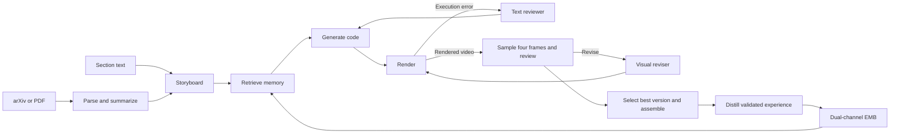

# Architecture

ManimAgent uses one generation graph for section text, arXiv input, and local PDFs. Text sections go directly to the storyboarder; arXiv and PDF inputs are parsed and summarized first.

## Agents and orchestration

| Component | Responsibility | Implementation |
|---|---|---|
| Storyboarder | Plan named scenes with a claim, supporting evidence, takeaway, and duration | [`agents/storyboarder.py`](../paper2manim/agents/storyboarder.py) |
| Coder | Generate complete Manim scene code with retrieved examples and pitfalls | [`agents/coder.py`](../paper2manim/agents/coder.py) |
| Renderer | Check the requested class, enforce resource limits, and render with Cairo | [`sandbox/render.py`](../paper2manim/sandbox/render.py) |
| Text reviewer | Diagnose execution errors and advise a retry | [`agents/reviewer.py`](../paper2manim/agents/reviewer.py) |
| VLM reviewer | Score logic flow, layout/occlusion, and accuracy from four sampled frames | [`agents/vlm_scene_reviewer.py`](../paper2manim/agents/vlm_scene_reviewer.py) |
| Visual reviser | Revise code while preserving the storyboard's scientific content | [`agents/visual_revision_agent.py`](../paper2manim/agents/visual_revision_agent.py) |
| Rationale writer | Explain a selected high-scoring scene | [`agents/rationale_writer.py`](../paper2manim/agents/rationale_writer.py) |
| Lesson distiller | Extract a transferable lesson from a validated repair | [`agents/lesson_distiller.py`](../paper2manim/agents/lesson_distiller.py) |

[`graphs/generation.py`](../paper2manim/graphs/generation.py) handles input, storyboarding, scene dispatch, video assembly, and memory consolidation. [`graphs/scene_graph.py`](../paper2manim/graphs/scene_graph.py) gives each scene its own generation and reflection state. Scene outputs merge through reducers. The optional narrator and TTS assembly add voiceover after storyboarding.

## Reflection and version selection

A scene starts with one generated candidate. It can execute at most two text retries and two visual revisions by default. Two consecutive failures in the same error category stop text repair. Reflection rounds count executed text retries plus executed visual revisions; the initial generation does not count.

The VLM assigns three scores from 0 to 100. Their mean determines the scene score; an average of at least 90 ends visual revision. The loop also stops on an explicit pass/fail decision or an exhausted revision budget. Incomplete or unavailable reviews do not qualify for scored memory writes.

The output uses the highest-scoring rendered candidate. Ties select the earlier version. A later crash does not discard an earlier scored video. Saved code, render sidecars, montages, and memory provenance identify the corresponding revision.

## Episodic memory

The EMB stores positive and negative records separately in SQLite and searches their embeddings with Faiss. The encoder is `sentence-transformers/all-MiniLM-L6-v2` with 384 dimensions. Queries and stored task embeddings combine section text and scene role. The encoder identity is pinned when a bank is created; reopening it with a different encoder is rejected.

The coder receives two positive records under **Reference Examples** and three negative records under **Known Pitfalls**. Empty banks retain both prompt slots with `[No entries available]`. Retrieved positive code is capped at 1,200 characters and rationale at 600 characters; newly distilled rationale is stored with a 400-character cap. Negative trigger, cause, and fix fields are capped at 400 characters, code fragments at 800 characters, and diagnostics at 1,000 characters.

Consolidation accepts:

- A positive record from the selected scene when its valid VLM score is at least 85.
- A negative lesson from adjacent render-error and render-success attempts.
- A negative lesson from adjacent visual versions when their valid scores improve by at least 5 points.

LLM distillation is enabled by default. Failed distillation does not create a substitute heuristic record. Provenance keys deduplicate repeated writes. Records persist across runs without automatic eviction. `--emb-readonly` retains retrieval while disabling consolidation and retrieval hit-counter updates.
