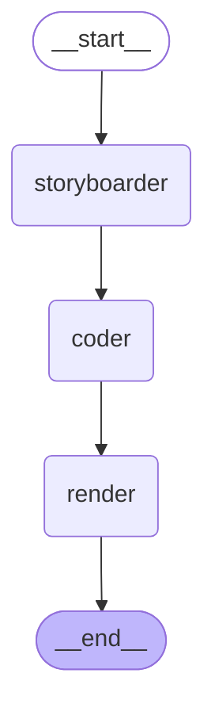
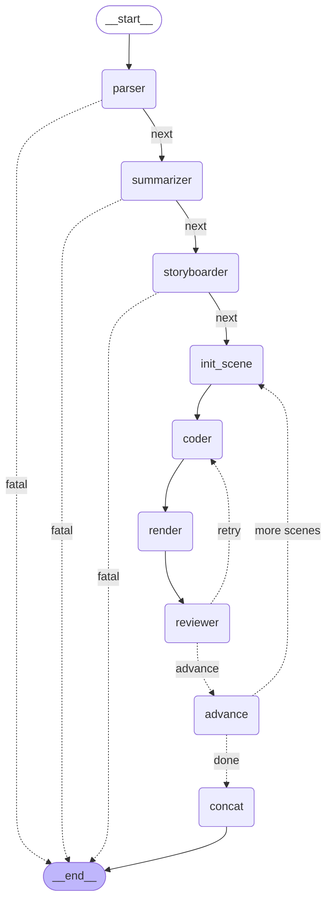

# Agent Collaboration Graphs

Live diagrams of the LangGraph `StateGraph` topologies. Re-generate with:

```bash
python -c "
from paper2manim.graphs.mvp1 import build_mvp1_graph
from paper2manim.graphs.mvp2 import build_mvp2_graph
print(build_mvp1_graph().get_graph().draw_mermaid())
print(build_mvp2_graph().get_graph().draw_mermaid())
"
```

`.mmd` source files are in `docs/graphs/`. GitHub renders the fenced blocks below natively.

---

## MVP 1.0 — 线性 pipeline

短文本 → 单场景视频。无反思、无分支。



| 节点 | 干嘛 | 读 | 写 |
|---|---|---|---|
| `storyboarder` | LLM 把 `raw_text` 拆成 1 个 Scene | `raw_text` | `storyboard` |
| `coder` | LLM 写 Manim 代码 | `storyboard[0]` | `current_code` |
| `render` | sandbox 跑 manim CLI | `current_code` | `attempts[]`, `rendered_videos[]` |

---

## MVP 2.0 — 含反思纠错的多场景闭环

PDF / arXiv → N 个 scene → 每个 scene 内 reflection loop → concat。两个 conditional edge（虚线箭头）：

- **reviewer** → `coder`（retry）或 `advance`（done / give_up）
- **advance** → `init_scene`（还有 scene）或 `concat`（全跑完）

外加 3 个 **fatal early-exit** edges（`parser` / `summarizer` / `storyboarder` 任一失败直接到 END）。



### 节点契约（state 字段读写）

| 节点 | 输入字段 | 输出字段 | 失败模式 |
|---|---|---|---|
| `parser` | `input_kind` / `pdf_path` / `arxiv_spec` / `arxiv_section` | `parsed_markdown` / `parsed_format` / `parser_source` | `fatal_error`（网络 / Marker 失败） |
| `summarizer` | `parsed_markdown` | `summary` | `fatal_error`（schema drift 重试后仍失败） |
| `storyboarder` | `summary` 或 `raw_text` | `storyboard` | `fatal_error`（同上） |
| `init_scene` | `storyboard`, `current_scene_idx` | 重置 `iter_count` / `error_feedback` / `current_code` | `fatal_error`（storyboard 缺失） |
| `coder` | 当前 scene + `error_feedback`（若上轮失败） | `current_code` | 让下游 render 报 python error |
| `render` | `current_code`, `quality` | `attempts[].render_result` | 静态检查失败 / subprocess 报错 / 超时 |
| `reviewer` | 最近一次 `attempts[-1]` | `attempts[-1].reviewer_decision/hint` + `error_feedback` / `iter_count` | 短路成功；硬 cap give_up |
| `advance` | `attempts[-1].render_result` | `rendered_videos[]` 或 `skipped_scenes[]`；`current_scene_idx += 1` | — |
| `concat` | `rendered_videos[]` | `final_video_path` | `fatal_error`（无任一成功 scene） |

### Reflection loop 的两条 conditional edge

```python
# paper2manim/graphs/mvp2.py
def should_retry(state) -> Literal["coder", "advance"]:
    last = state["attempts"][-1]
    if last["render_result"]["status"] == "success": return "advance"
    if state["iter_count"] >= state["max_retries"]:  return "advance"  # give_up
    if last.get("reviewer_decision") == "give_up":   return "advance"
    return "coder"                                                     # retry

def has_more_scenes(state) -> Literal["init_scene", "concat"]:
    return "init_scene" if state["current_scene_idx"] < len(state["storyboard"]["scenes"]) else "concat"
```

### 一次典型 5-scene 跑批的递归深度上限

`recursion_limit=80`：5 scenes × (init_scene + coder + render + reviewer + advance = 5 节点) × 最多 3 retry ≈ 75 节点访问，加上前置 3 节点（parser/summarizer/storyboarder）+ concat 留余量。

---

## 怎么交互式看

1. **VS Code**：装 *Markdown Preview Mermaid Support*，直接预览本文件
2. **浏览器**：把 `docs/graphs/mvp2.mmd` 粘到 https://mermaid.live
3. **导 PNG**：在能访问 `mermaid.ink` 的环境下：
   ```python
   from paper2manim.graphs.mvp2 import build_mvp2_graph
   Path("mvp2.png").write_bytes(build_mvp2_graph().get_graph().draw_mermaid_png())
   ```
4. **终端 ASCII**：`pip install grandalf` 后
   ```python
   print(build_mvp2_graph().get_graph().draw_ascii())
   ```
