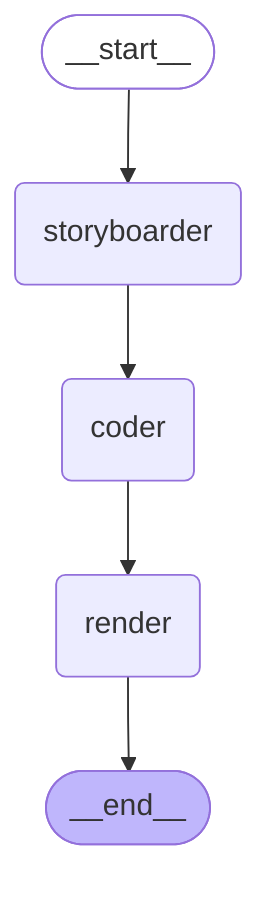
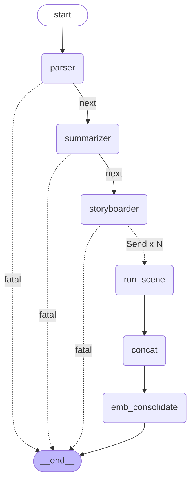
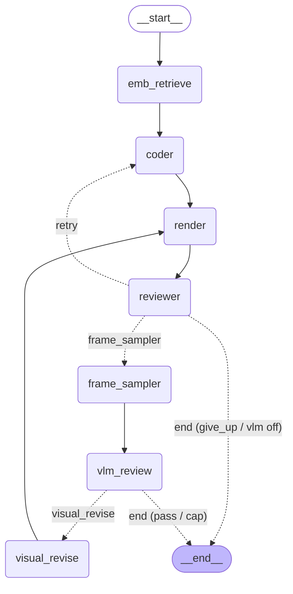

# Agent Collaboration Graphs

Live diagrams of the LangGraph `StateGraph` topologies. Re-generate with:

```bash
python -c "
from paper2manim.graphs.mvp1 import build_mvp1_graph
from paper2manim.graphs.mvp2 import build_mvp2_graph
from paper2manim.graphs.scene_graph import build_scene_graph
print(build_mvp1_graph().get_graph().draw_mermaid())
print(build_mvp2_graph().get_graph().draw_mermaid())
print(build_scene_graph().get_graph().draw_mermaid())
"
```

`.mmd` source files are in `docs/graphs/` (`mvp1.mmd` / `mvp2.mmd` / `scene_graph.mmd`). GitHub renders the fenced blocks below natively.

---

## MVP 1.0 — 线性 pipeline

短文本 → 单场景视频。无反思、无分支。



| 节点 | 干嘛 | 读 | 写 |
|---|---|---|---|
| `storyboarder` | LLM 把 `raw_text` 拆成 1 个 Scene | `raw_text` | `storyboard` |
| `coder` | LLM 写 Manim 代码 | `storyboard[0]` | `current_code` |
| `render` | sandbox 跑 manim CLI | `current_code` | `attempts[]`, `rendered_videos[]` |

---

## MVP 2.0 — fan-out 并行 + 双反思闭环

PDF / arXiv → 拆 N 个 scene → 每个 scene 通过 `langgraph.types.Send` 分发到独立的 per-scene 子图并发跑 → concat → EMB 蒸馏。**父图扁平**，所有反思（文本 + 视觉）和 EMB 检索都在子图里。

> 拓扑由 `build_mvp2_graph()` 在运行时生成；下方 mermaid 与 `docs/graphs/mvp2.mmd` 都是从 `get_graph().draw_mermaid()` 落盘的，改图后请重新生成（见文末"怎么交互式看"）。

### 父图

3 个 fatal early-exit edges（`parser` / `summarizer` / `storyboarder` 任一置 `fatal_error` 直接到 END）；`storyboarder` 成功时一次性 `Send × N` 把 N 个 scene 全发出去。



### 父图节点契约（PaperState 字段读写）

| 节点 | 输入字段 | 输出字段 | 失败模式 |
|---|---|---|---|
| `parser` | `input_kind` / `pdf_path` / `arxiv_spec` / `arxiv_section` | `parsed_markdown` / `parsed_format` / `parser_source` | `fatal_error`（网络 / Marker 失败） |
| `summarizer` | `parsed_markdown` | `summary` | `fatal_error`（schema drift 重试后仍失败） |
| `storyboarder` | `summary` 或 `raw_text` | `storyboard` | `fatal_error`（同上） |
| `run_scene` | 子图 payload（一个 scene 的 SceneState） | reduce 进 PaperState：`attempts[]`, `rendered_videos[]`, `skipped_scenes[]`, `visual_revision_decisions[]`, `scene_reports[]` | 子图内 give_up → 进 `skipped_scenes`；不阻塞其它 scene |
| `concat` | `rendered_videos[]` | `final_video_path` | 无成功 scene → 跳过 concat（不致命） |
| `emb_consolidate` | `trace.jsonl` + `attempts/` + `emb_*` 配置 | `emb_writes[]`（成功 / 失败记录入库 stats） | `--emb` 关闭时 no-op |

### 子图（per-scene `scene_graph.SceneState`）

每个 `Send` 在自己的 SceneState 实例里跑这张图。两条 conditional edge：

- **reviewer** → `coder`（render 失败且未触 cap）/ `frame_sampler`（render 成功且 `--vlm` 开）/ `end`（give_up 或 vlm 关）
- **vlm_review** → `visual_revise`（decision=revise）/ `end`（decision=pass 或触 `max_visual_revisions` cap）



### 子图节点契约（SceneState 字段读写）

| 节点 | 输入字段 | 输出字段 | 失败模式 |
|---|---|---|---|
| `emb_retrieve` | scene 描述 + `emb_*` 配置 | `retrieved_success[]` / `retrieved_failure[]`（注入 coder prompt 的 Reference Examples / Known Pitfalls） | `--emb` 关闭时 no-op |
| `coder` | scene + `retrieved_*` + `error_feedback`（上轮失败时） | `current_code` | 让下游 render 报错 |
| `render` | `current_code`, `quality` | `attempts[].render_result` | 静态预检失败 / subprocess 错 / 超时 |
| `reviewer` | `attempts[-1]` | `reviewer_decision` / `hint` / `error_feedback`；`iter_count += 1` | 触 `max_retries` cap → give_up |
| `frame_sampler` | 成功 `rendered_video` | `current_montage_path`（ffmpeg 抽 N 帧 hstack PNG） | 抽帧失败 → 跳过 VLM 直接 END |
| `vlm_review` | montage + scene 描述 | `last_visual_review`（3 维 × 0–100 + decision + avg）；`visual_revision_decisions[]` | LLM 抛异常 → auto-pass |
| `visual_revise` | `current_code` + `last_visual_review.revision_instruction` | 新 `current_code`；`vlm_revision_count += 1` | 异常时回退原 code，不中断 |

### 两条 conditional edge 的判定逻辑

```python
# paper2manim/graphs/scene_graph.py
def post_reviewer_route(state) -> Literal["coder", "frame_sampler", "end"]:
    decision = state.get("reviewer_decision")
    if decision == "retry":                                       return "coder"
    if decision == "advance" and state.get("vlm_enabled", False): return "frame_sampler"
    return "end"  # give_up / vlm off / no rendered_video

def post_vlm_route(state) -> Literal["visual_revise", "end"]:
    review = state.get("last_visual_review") or {}
    if review.get("decision") == "revise" and \
       state.get("vlm_revision_count", 0) < state.get("max_visual_revisions", 2):
        return "visual_revise"
    return "end"  # pass / cap / fail (soft-fail keeps rendered video)
```

### Recursion limit

父图扁平（5 个固定节点 + 1 个 Send 步骤），`cli.py` 给父图设 `recursion_limit = 50`。每个 `run_scene` 内部对子图单独设 `max(60, 6 + 3 * (max_retries + 1) + 5 * max_visual_revisions + 4)`（`graphs/mvp2.py:152`）——默认 `max_retries=3` / `max_visual_revisions=2` 时算出 32，被下限 60 覆盖。

---

## 怎么交互式看

1. **VS Code**：装 *Markdown Preview Mermaid Support*，直接预览本文件
2. **浏览器**：把 `docs/graphs/mvp2.mmd` 粘到 https://mermaid.live
3. **导 PNG**：在能访问 `mermaid.ink` 的环境下：
   ```python
   from paper2manim.graphs.mvp2 import build_mvp2_graph
   Path("mvp2.png").write_bytes(build_mvp2_graph().get_graph().draw_mermaid_png())
   ```
4. **终端 ASCII**：`pip install grandalf` 后
   ```python
   print(build_mvp2_graph().get_graph().draw_ascii())
   ```
